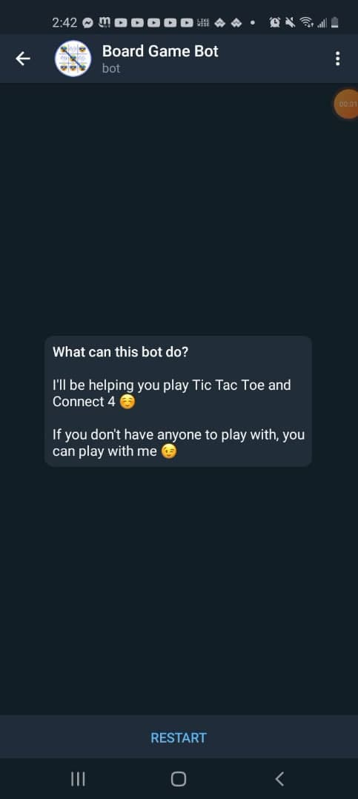

# Telegram Board Game Bot
 
Telegram bot that allows users to select from a variety of board games to simulate, and play in either single player or multiplayer mode.
  
To use access the bot, type in <strong> @TicTacBoardBot</strong> into any chat Telegram
 
 

## Tic Tac Toe Board Demo

 
 

## Changing Board Symbol

 
 

## Connect 4 Demo

 
 

## Home Screen / Start Menu

 

&nbsp;&nbsp;&nbsp;&nbsp;&nbsp;&nbsp;&nbsp;&nbsp;&nbsp;&nbsp;&nbsp;&nbsp;
<strong>Home Screen where the user can start up the bot</strong>

 
 

 

&nbsp;&nbsp;&nbsp;&nbsp;&nbsp;&nbsp;&nbsp;&nbsp;&nbsp;&nbsp;&nbsp;&nbsp;&nbsp;&nbsp;&nbsp;
<strong> Start Menu -  User selects which game to play </strong>
 
 
 

## Tic Tac Toe Board

&nbsp;&nbsp;&nbsp;&nbsp;&nbsp;&nbsp;&nbsp;&nbsp;
* <strong> Tic Tac Toe board size selection </strong>
* <strong>Player may select default or custom sizes</strong>
 
 

&nbsp;&nbsp;&nbsp;&nbsp;&nbsp;&nbsp;&nbsp;&nbsp;
* <strong> Tic Tac Toe Board layout and game directions </strong>
* <strong>Player may select between single and multiplayer modes</strong>
 
 

&nbsp;&nbsp;&nbsp;&nbsp;&nbsp;&nbsp;&nbsp;&nbsp;
* <strong> Player chooses how many moves are required to win the game </strong>
* <strong>Player may either type in the amount or use the /matches command</strong>
 
 

&nbsp;&nbsp;&nbsp;&nbsp;&nbsp;&nbsp;&nbsp;&nbsp;
* <strong> Player makes a move by typing in the desired location to move </strong>
* <strong>The Board is displayed with the player's mark placed at the desired location</strong>
 
 

&nbsp;&nbsp;&nbsp;&nbsp;&nbsp;&nbsp;&nbsp;&nbsp;
* <strong> Player may change their symbol by using the /changesymbol command </strong>
* <strong>Symbol can be changed to any character or emoji on the keyboard</strong>
 
 

&nbsp;&nbsp;&nbsp;&nbsp;&nbsp;&nbsp;&nbsp;&nbsp;
* <strong> The player is notified once they win the game </strong>
* <strong>Number of adjacent matching symbols must equal to the   number set at the beginning of the game</strong>
 
 

## Connect 4 Board

 

&nbsp;&nbsp;&nbsp;&nbsp;&nbsp;&nbsp;&nbsp;&nbsp;&nbsp;&nbsp;&nbsp;&nbsp;&nbsp;&nbsp;&nbsp;&nbsp;&nbsp;&nbsp;&nbsp;&nbsp;&nbsp;&nbsp;&nbsp;&nbsp;&nbsp;
<strong> Connect 4 board layout </strong>
 
 
 

 

&nbsp;&nbsp;&nbsp;&nbsp;&nbsp;&nbsp;&nbsp;&nbsp;&nbsp;&nbsp;&nbsp;&nbsp;&nbsp;&nbsp;&nbsp;&nbsp;&nbsp;&nbsp;&nbsp;&nbsp;&nbsp;&nbsp;&nbsp;&nbsp;&nbsp;&nbsp;&nbsp;&nbsp;&nbsp;&nbsp;&nbsp;&nbsp;
<strong> Connect 4 player win </strong>
 
 
